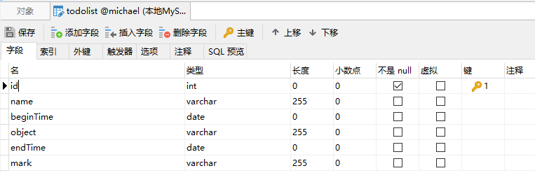
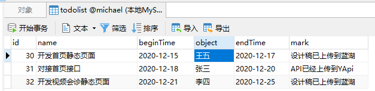
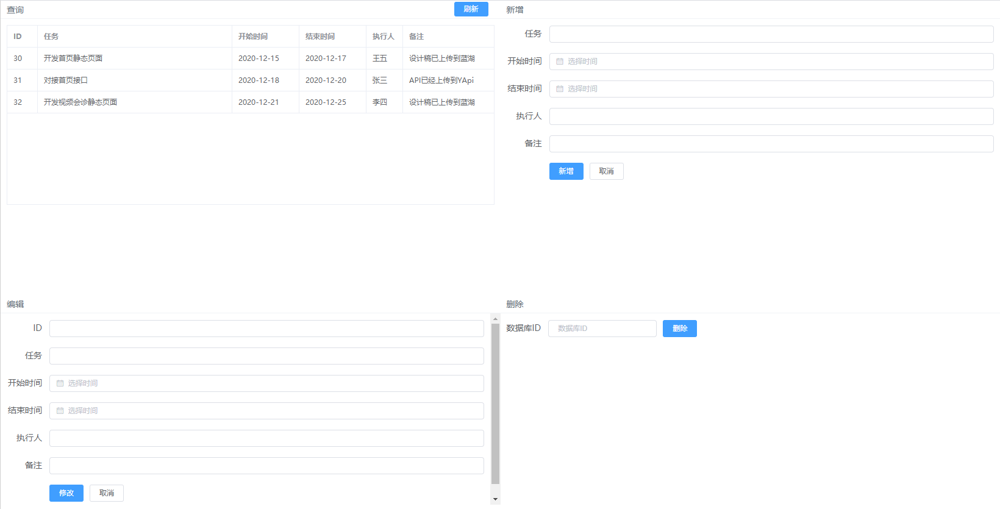

# Node.js遇上了MySQL


### 认识Node.js

1. Node.js 是一个基于 Chrome V8 引擎的 [JavaScript](https://baike.baidu.com/item/JavaScript/321142) 运行环境。 Node.js 使用了一个事件驱动、非阻塞式 I/O 的模型。 [1] 

   Node 是一个让 JavaScript 运行在[服务端](https://baike.baidu.com/item/服务端/6492316)的开发平台，由Ryan Dahl开发，实质是对Chrome V8引擎进行了封装。

   Node对一些特殊用例进行优化，提供替代的[API](https://baike.baidu.com/item/API/10154)，使得V8在非浏览器环境下运行得更好。V8引擎执行Javascript的速度非常快，性能非常好。Node是一个基于Chrome JavaScript运行时建立的平台， 用于方便地搭建响应速度快、易于扩展的网络应用。Node 使用[事件驱动](https://baike.baidu.com/item/事件驱动/9597519)， 非阻塞[I/O](https://baike.baidu.com/item/I%2FO/84718) 模型而得以轻量和高效，非常适合在分布式设备上运行数据密集型的实时应用。

2. Node的优点：

   RESTful API

   单线程

   Node可以在不新增额外线程的情况下，依然可以对任务进行并发处理 —— Node.js是单线程的。它通过事件循环（event loop）来实现并发操作，对此，我们应该要充分利用这一点 —— 尽可能的避免阻塞操作，取而代之，多使用非阻塞操作。

   非阻塞IO

   V8虚拟机

   事件驱动

   

### 目标

使用Nodejs搭建的服务，配合MySQL，开发API，提供给前端，实现功能业务。


### 准备工作

1. 安装Node v10.0.0以上（同时会附带安装了NPM），并检查是否安装成功：

   ```javascript
   cmd         # 查看版本
   node -v
   npm -v
   ```

2.  安装MySQL

   ```mysql
   下载地址：
   https://dev.mysql.com/downloads/windows/installer/8.0.html
   
   MySQL8.0版本以上加密方式，Node不支持。
   解决方案（打开MySQL命令行终端）：
   alter user 'root'@'localhost' identified with mysql_native_password by '#此处填写你的数据库密码#';
   flush privileges;
   ```

   > 目前Node.js支持市面大部分的数据库，如Oracle、Cassandra、Couchbase、CouchDB、LevelDB、MySQL、MongoDB、Redis、SQL Server、ElasticSearch等等。

3. 使用`Navicat`创建数据库，并建立数据表

   

   或，查询语句建表：

   ```mysql
   CREATE TABLE IF NOT EXISTS `todolist`(
      `id` INT UNSIGNED AUTO_INCREMENT,
      `name` VARCHAR(100) NOT NULL,
      `object` VARCHAR(100) NOT NULL,
      `beginTime` DATE,
      `endTime` DATE,
      `mark` VARCHAR(100) NOT NULL,
      PRIMARY KEY ( `id` )
   )ENGINE=InnoDB DEFAULT CHARSET=utf8;
   ```


### 创建Node服务

1. 新建一个文件夹，在此文件夹下打开cmd，输入`npm init -y`初始化一个项目，输入一些基本信息。

2. 安装所需依赖包：`npm i body-parser cookie-parser cors express multer mysql -S`

   > 依赖包mysql，是操作mysql数据库的一个JS插件

3.  在根目录新建文件`index.js`，并键入代码：

   ```javascript
   const express = require('express');
   const app = express();
   const port = 80;
   app.listen(port, () => console.log(`服务启动成功，端口号为：${port}`));
   ```

4.  cmd输入`node index.js`，浏览器打开localhost，但为`Cannot GET /`。

5. 写一个get接口，返回内容：

   ```javascript
   app.get('/', (req, res) => {
   	res.json('Hello world!')
   })
   ```

   浏览器打开localhost，可看到内容。

   > res.send 以页面的方式返回去；
   >
   > res.download 以文件的方式返回，前端请求会下载此文件；

   ```javascript
   app.get('/', (req, res) => {
   	res.send('<div style="color: red;">Hello world!</div>')
   })
   ```

6. 觉得每次改动都需要重启服务，影响开发效率。解决方案：

   安装热刷新包：`npm i hotnode -S`

   并在文件`pageage.json`增加`scripts`命令：

   ```javascript
   "script": {
       "start": "hotnode index.js"
   }
   ```

   后面启动服务可以使用命令：`npm start`


### POST方法

1. 键入：

   ```javascript
   app.post('/post', (req, res) => {
   	res.json('Hello world!')
   })
   ```

   使用`Postman`测试接口

2.  使用all方法和正则表达，拦截所有接口，如登录状态拦截：

   ```javascript
   app.all('*', (req, res, next) => {
       // 判断登录token是否存在且有效，否则重定向到登录页面
       
       // 如果有效，则向下匹配
   	next();
   })
   ```

3.  如何接收前端请求的参数？先引入中间件。

   ```javascript
   const bodyParser = require('body-parser');  		// 解析Api参数
   app.use(bodyParser.json()); 						// json请求
   app.use(bodyParser.urlencoded({extended: false})); 	// 表单请求
   ```

4.  写一个可以接收参数的post方法：

   ```javascript
   app.post('/test/:data', (req, res) => {
   	 res.json({
            code: 200,
            query: req.query,   // ？后面的参数
            data: req.params,   // 路径上的参数，如:data
            json: req.body		 // body的参数
        })
   })
   ```

   使用`Postman`测试接口
   
   ```javascript
   127.0.0.1/test/10086?id=10010
   {
       "name": "放飞机",
       "beginTime": "2020-12-16",
       "endTime": "2020-12-20",
       "object": "李四",
       "mark": "sdf"
   }
   ```
   
   

### 跨域问题

1. 引入依赖包：

   ```javascript
   const cors = require('cors');
   app.use(cors());            	// 解决跨域
   ```


### 连接数据库

1.  刚刚已经建表了，现在使用navicat插入几条数据：

   

2. 连接数据库：

   ```javascript
   const mysql = require('mysql');             // 引入MySQL
   const option = {
       host: 'localhost',
       user: 'root',
       password: '123456',
       port: '3306',
       database: 'michael',
       connectTimeout: 5000,       // 连接超时
       multipleStatements: true,  	// 是否允许一个query中包含多条SQL语句
   }
   
   const conn = mysql.createConnection(option);
   ```

3.  创建返回结果的构造方法

   ```javascript
   function Result({code = 200, msg= '', data = null}) {
       this.code = code;
       this.msg = msg;
       this.data = data;
   }
   ```
   
4. 建立含有数据库查询语句的请求方法：

   ```javascript
   app.all('/toDoList/getList', (req, res) => {
       conn.query('SELECT * FROM todolist', (e, r) => {
           res.json(new Result({
               data: r,
           }))
       });
   })
   ```

   测试，浏览器访问：localhost/toDoList/getList

5. 重连机制

   ```javascript
   let conn;
   reconn();
   
   function reconn() {
       conn = mysql.createConnection({option});
       conn.on('error', err => err.code === 'PROTOCOL_CONNECTION_LOST' && setTimeout(repool, 2000));
   }
   ```

   > 监听error事件，如果err.code返回了以上字符，那么我们就重新发起连接，直到连接成功。

6. 以上是单线程连接。如何解决高并发连接问题？


### 建立连接池

1. 创建重连机制方法：

   ```javascript 
   let pool;
   repool();

   // 断线重连机制
   function repool() {
       // 创建连接池
       pool = mysql.createPool({
           ...option,
           waitForConnections: true,   // 当无连接池可用时，等待（true），还是抛异常（false）
           connectionLimit: 100,       // 连接数限制
           queueLimit: 0,              // 最大连接等待数（0为不限制）
       })
       pool.on('error', err => err.code === 'PROTOCOL_CONNECTION_LOST' && setTimeout(repool, 2000));
       app.all('*', (_, __, next) => pool.getConnection(err => err && setTimeout(repool, 2000) || next()));
   }
   ```

2. 变更连接方法：

   ```javascript
   app.get('/toDoList/getList', (req, res) => {
       pool.getConnection((err, conn) => {
           conn.query('SELECT * FROM todolist', (e, r) => {
               res.json(new Result({
                   data: r,
               }))
           });
           conn.release();
       })
   })
   ```
   
   > conn.release() 释放连接池，用完就要释放给别的请求使用。
   
6. 我们开发接口不可能把所有接口，都放到一个文件里面。这个时候就要做模块化分离，将连接数据库、请求方法、入口文件分离开。


### 模块块

1. 依赖express.Router()这个API，引入：

   ```javascript
   const router = express.Router();
   ```

2.  暴漏以下模块出去：连接池、返回结果构造方法、express路由、app。并将js文件更名为`connect.js`，并将所有请求方法删除。

   ```javascript
   module.exports = {pool, Result, router, app};
   ```

3.  建立一个新文件夹，用来放置某模块的请求方法：

   

4.  `/todolist/index.js`内容为：

   ```javascript
   const { pool, router, Result } = require("../connect");
   
   // 查询
   router.get("/getList", ( req, res ) => {
     pool.getConnection(( err, conn ) => {
       conn.query("SELECT * FROM todolist", ( e, data ) => {
         res.json(new Result({ data }));
       });
       conn.release();
     });
   });
   
   module.exports = router;
   ```

5.   入口文件，引入具体模块（具体内容请看`场景实践`第3点）：

   ```javascript
   app.use('/toDoList', toDoList);
   ```

   可以保留全局拦截：

   ```javascript
   app.all('*', (req, res, next) => {
       // 这里处理全局拦截，一定要写在最上面，不然会被别的接口匹配到而没有执行next导致捕捉不到
       next();
   })
   ```

6. 记得更改`package.json`文件里面的命令：

   ```javascript
   "start": "hotnode index.js"
   ```

   

### 场景实践

1. 需求：给前端提供toDoList功能模块的新、增、改、查4个接口。

2. 提前准备：前端服务、静态页面。

   

3.  入口文件内容：

   ```javascript
   const {app} = require('./connect');
   const toDoList = require('./todolist/index');
   
   app.all('*', (req, res, next) => {
       // 这里处理全局拦截，一定要写在最上面，不然会被别的接口匹配到而没有执行next导致捕捉不到
       next();
   })
   
   app.use('/toDoList', toDoList);
   
   const port = 80;
   app.listen(port, () => {
       console.log(`服务启动，端口号：${port}`)
   })
   ```

4.  连接文件`connect.js`内容：

   ```java
   const express = require('express');
   const mysql = require('mysql');             // 引入MySQL
   const cors = require('cors');
   const bodyParser = require('body-parser');  // 解析Api参数
   const app = express();
   const router = express.Router();
   
   const option = {
       host: 'localhost',
       user: 'root',
       password: '123456',
       port: '3306',
       database: 'michael',
       connectTimeout: 5000,       // 连接超时
       multipleStatements: true,  // 是否允许一个query中包含多条SQL语句
   }
   
   app.use(cors());            // 解决跨域
   app.use(bodyParser.json()); // json请求
   app.use(bodyParser.urlencoded({extended: false})); // 表单请求
   
   let pool;
   repool();
   
   function Result({code = 200, msg= '', data = null}) {
       this.code = code;
       this.msg = msg;
       this.data = data;
   }
   
   // 断线重连机制
   function repool() {
       // 创建连接池
       pool = mysql.createPool({
           ...option,
           waitForConnections: true,   // 当无连接池可用时，等待（true），还是抛异常（false）
           connectionLimit: 100,       // 连接数限制
           queueLimit: 0,              // 最大连接等待数（0为不限制）
       })
       pool.on('error', err => err.code === 'PROTOCOL_CONNECTION_LOST' && setTimeout(repool, 2000));
       app.all('*', (_, __, next) => pool.getConnection(err => err && setTimeout(repool, 2000) || next()));
   }
   
   module.exports = {pool, Result, router, app};
   ```

5. 模块文件 `/todolist/index.js`内容：

   ```javascript
   const { pool, router, Result } = require("../connect");
   
   // 查询
   router.get("/getList", ( req, res ) => {
     pool.getConnection(( err, conn ) => {
       conn.query("SELECT * FROM todolist", ( e, data ) => {
         res.json(new Result({ data }));
       });
       conn.release();
     });
   });
   
   // 新增
   router.post("/addToDo", ( req, res ) => {
     console.log(req.body);
     if ( !req.body.name || !req.body.beginTime || !req.body.endTime || !req.body.object || !req.body.mark ) {
       res.json({
         code: 400,
         msg: "参数有误",
         data: null
       });
       return;
     }
     // 如果参数值是string类型，那么用单引号包起来
     for ( let i in req.body ) {
       if ( typeof req.body[i] === "string" ) {
         req.body[i] = `'${req.body[i]}'`;
       }
     }
     pool.getConnection(( err, conn ) => {
       conn.query(`INSERT INTO todolist (name, beginTime, endTime, object, mark) values (${req.body.name}, ${req.body.beginTime}, ${req.body.endTime}, ${req.body.object}, ${req.body.mark})`, ( e, data ) => {
         console.log(data);
         console.log(e);
         res.json(new Result({ msg: "增加成功" }));
       });
       conn.release();
     });
   });
   
   // 删除
   router.post("/deleToDo", ( req, res ) => {
     if ( !req.body.id ) {
       res.json({
         code: 400,
         msg: "参数有误",
         data: null
       });
       return;
     }
     // 如果参数值是string类型，那么用单引号包起来
     for ( let i in req.body ) {
       if ( typeof req.body[i] === "string" ) {
         req.body[i] = `'${req.body[i]}'`;
       }
     }
     pool.getConnection(( err, conn ) => {
       conn.query(`DELETE FROM todolist WHERE id = ${req.body.id}`, ( e, data ) => {
         const isExist = data.affectedRows > 0 ? true : false;
         if(isExist) {
           res.json(new Result({ msg: "删除成功" }));
         } else {
           res.json(new Result({ code: 400, msg: "ID不存在" }));
         }
       });
       conn.release();
     });
   });
   
   // 编辑
   router.post("/editTodo", ( req, res ) => {
     if ( !req.body.id || !req.body.name || !req.body.beginTime || !req.body.endTime || !req.body.object || !req.body.mark ) {
       res.json({
         code: 400,
         msg: "参数有误",
         data: null
       });
       return;
     }
     // 如果参数值是string类型，那么用单引号包起来
     for ( let i in req.body ) {
       if ( typeof req.body[i] === "string" ) {
         req.body[i] = `'${req.body[i]}'`;
       }
     }
     pool.getConnection((err, conn) => {
       conn.query(`UPDATE todolist SET name=${req.body.name}, beginTime=${req.body.beginTime}, endTime=${req.body.endTime}, object=${req.body.object}, mark=${req.body.mark} WHERE id=${req.body.id}`, (e, data) => {
   
         console.log(data);
         console.log(e);
         if(!e) {
           const isExist = data.affectedRows > 0 ? true : false;
           if(isExist) {
             res.json(new Result({ msg: "更新成功" }));
           } else {
             res.json(new Result({ code: 400, msg: "ID不存在" }));
           }
         } else {
           // 数据库语句异常
           res.json(new Result({ code: 400, msg: e.sqlMessage }));
         }
       })
       conn.release();
     })
   });
   
   module.exports = router;
   ```


### 总结

1. 校验前端带过来的参数，应该有优秀的库处理。如：校验是否有传递必要的参数，参数是否正确？
2. 数据库字段如果为`string`类型，需要在用单引号包裹才能放到查询语句里面。应该也有优秀的库处理。
3. 还没有更深入了解，操作数据库后，返回的异常信息。根据不同的异常，去处理不同问题。应该也有优秀的库处理。
4. 适合开发小应用、轻量级的单页面应用。
5. 涉及更多的业务场景，需要解决的地方还有很多，值得继续去探究。
6. 仅仅能给将要入坑后台的开发，带来一点兴趣，起码可以学会一点数据库查询语句。